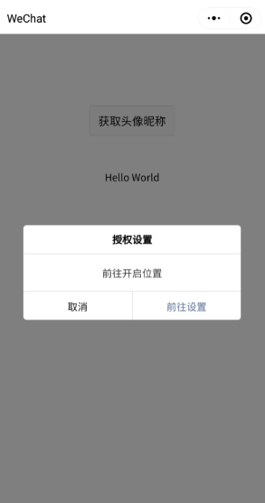
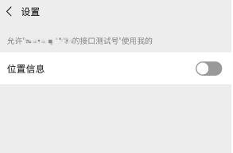
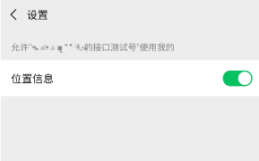

# miniprogram 微信小程序

- [utils/authorize 附注释](./authorize.js)
- [demo/utils/authorize demo项目种的工具函数](https://github.com/metxnbr/miniprogram-authorize/blob/master/utils/authorize.js)

- [demo仓库](https://github.com/metxnbr/miniprogram-authorize/tree/master)

关于小程序, 暂只谈下授权方面的, 引导用户开启权限, 设计一个合理的交互, 让程序继续下去.
有的小程序需设计为某权限必须开启才能继续, 在这种情况下合理的引导交互, 显得尤为重要.
当权限被拒, 程序不会有报错的尴尬, 同时给出一个合理的引导界面, 这里可以是自定义的弹窗,
当然从用户角度, 这自定义弹窗也得有一个取消按钮

授权引导, 我目前了解, 小程序自身有2种方式: 第一个是底部弹出授权请求的弹窗, 让用户选择,
这个是最直接的,当前界面, 弹窗形式;  
第二个是让用户跳转到特定设置页面开启一些权限的按钮开关, 用户设置完可以跳转回.

通过调用`wx.authorize`的接口可以激活第一个, 但第一个如果用户已经拒绝了, 下次`wx.authorize`就不会继续出现弹窗,
你可以通过`<button open-type="getUserInfo"/>`让它再次弹出

那么第二个引导, 什么时候用呢? `button`里的`open-type`不支持的时候, 可以使用第二种引导, 比如
录音, 摄像权限等. 可以通过`wx.openSetting`调用第二个.

第二个用户也可以通过小程序界面一步一步进入的, 但这是针对用户的, 而对于开发者而言, 就需要使用`wx.openSetting`,
设计一个ui交互, 完成快捷的进入  
需要注意的是, 只有用户发生点击行为后, 才能调用`wx.openSetting`

- **自定义一个弹窗, 让用户点击, 调用 `wx.openSetting`**

- **权限未开启**

- **用户选择开启后, 点击左上角返回, 小程序将成功调用该权限**

